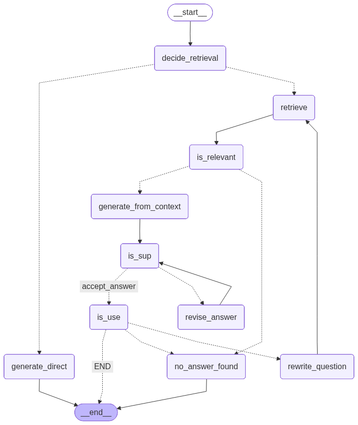

## Self RAG:

Self-RAG (Self-Reflective Retrieval-Augmented Generation) is an advanced RAG paradigm in which a language model actively reasons about when, how, and whether to retrieve external knowledge, rather than blindly relying on a fixed retrieve-then-generate pipeline. In Self-RAG, the model evaluates the user query and its own intermediate responses to decide if retrieval is necessary, retrieves only when helpful, and then critically assesses the relevance and grounding of the retrieved documents before producing a final answer. This introduces self-reflection into the loop: the model can judge whether the retrieved information supports the answer, whether the answer is sufficiently grounded in evidence, or whether the question should be rewritten to improve retrieval quality. By doing so, Self-RAG reduces hallucinations, avoids unnecessary retrieval costs, and improves factual accuracy, especially for knowledge-intensive or ambiguous queries.

Architecturally, Self-RAG is often implemented as a multi-step control flow (frequently using graph-based frameworks like LangGraph) that includes decision nodes for retrieval, document relevance filtering, answer verification, and optional query rewriting. After an initial generation attempt, the model may label an answer as useful or not useful, check if it is supported by retrieved passages, and either finalize the response, retrieve again with a refined query, or gracefully abstain when no reliable answer can be found. This feedback-driven loop closely mirrors human research behavior—searching, reading, revising, and validating before answering—and makes Self-RAG particularly powerful for production RAG systems where trustworthiness, explainability, and robustness matter more than raw fluency.

## Langgraph Workflow Implementation:

